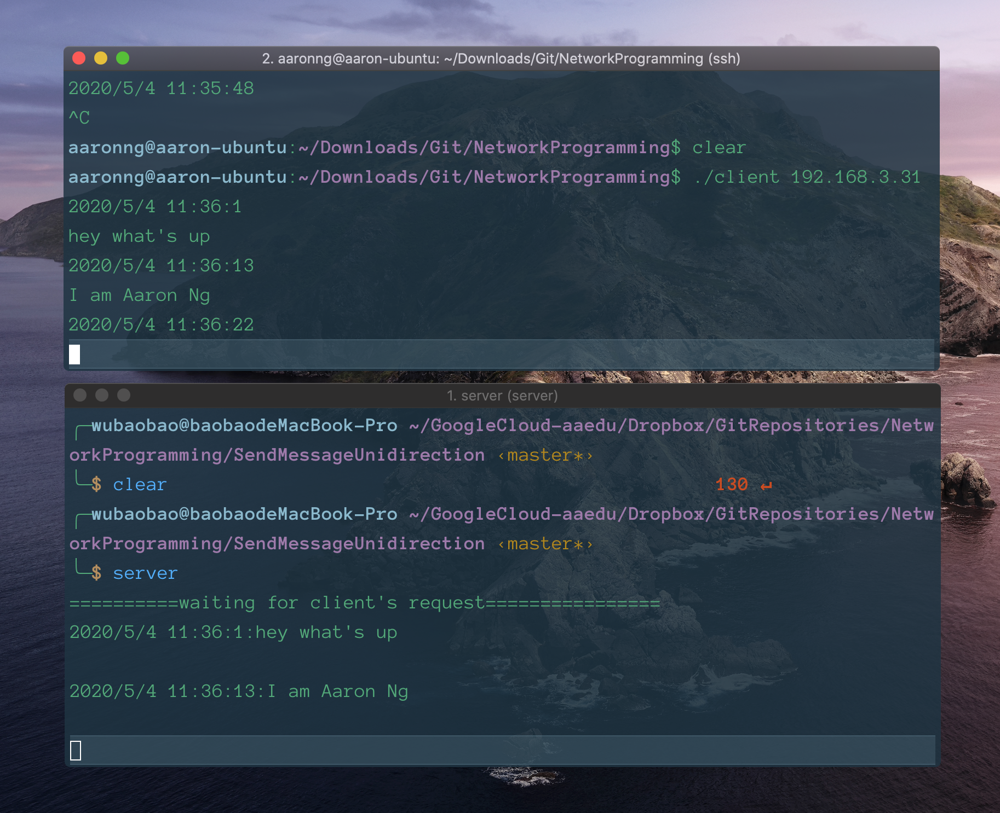

# 网络编程实践

## Project 1:单向发送消息(client -> server)

### DEMO:

**功能**: 通过client向server发送消息, server接收消息并输出

### 如何使用:

- 文件包含在`./SendMessageUnidirection`中
- 其中包含:
  - client.cpp和server.cpp
  - client和server, 可执行文件, 如果这两个文件存在, 可直接跳到下一步骤“运行server和client”; 如果没有, 通过下一步的makefile文件生成这两个可执行文件
  - 一个makefile文件: 用于编译链接生成可执行文件(client和server)
    - 在路径下执行`make`即可
    - 若修改client.cpp或server.cpp后, 可删除相关.o文件和可执行文件,重新`make`
  - 可能会有client.o, server.o, 是在makefile过程中生成的中间编译文件, 可忽略可删除
- 运行server和client
  - 终端一: 在路径执行`./server`, 启动服务端, 监听6666端口
  - 终端二: (需要在server启动后执行)在路径下执行`./client [server主机地址]`, 如`./client 127.0.0.1`(本地地址), 之后输入发送内容即可
  - 若终端没有`ctrl+c`正常退出或其他情况出现bind socket error:Address already in use(error:48), 可执行`sudo lsof -i:6666`查看6666号端号占用情况, 执行`sudo kill [PID]`干掉对应进程